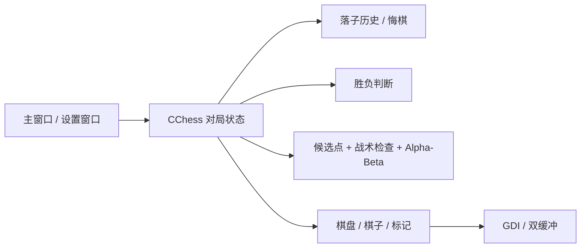

# FiveChess

一个用 **C++ / MFC** 写的 Windows 五子棋程序。项目最初来自东南大学 2024 年暑期学校课程实践，后来继续补了人机对战、界面、自适应布局、悔棋和自动构建等功能。

> 当前版本：**2.2** · Visual Studio 2022 · Win32 · MFC

## 功能

- 15 × 15 棋盘与五子连珠胜负判断
- 人机对战：玩家执黑，AI 执白
- 双人对战：本地黑白双方轮流落子
- 三档 AI：初级 / 标准 / 高级
- Alpha-Beta 剪枝、候选点生成、邻域裁剪和走法排序
- AI 落子前优先检查一步获胜与一步必防位置
- 多步落子历史与悔棋
- 终局后仍可悔棋继续本局
- 最近一步红点标记、五连获胜线和落子悬停预览
- A–O / 1–15 棋盘坐标
- 自适应窗口布局与右侧对局信息面板
- `Ctrl + Z` 悔棋，`F2` / `Ctrl + N` 开始新对局
- GitHub Actions 自动构建 `Release | Win32` 并打包 Windows 可执行文件

## 界面与交互

主窗口左侧是棋盘，右侧显示当前状态、对战模式、AI 难度、落子数和是否可以悔棋。棋盘会标记最近一步，形成五连后画出对应连线；鼠标移动到空交叉点时会显示落子预览。

设置窗口可以切换人机 / 双人模式和 AI 难度。双人模式下 AI 难度会自动禁用，应用设置后直接开始新对局。

## AI

AI 代码在 `FiveChess/ChessAI.cpp`。

普通搜索前会先做一次直接的战术检查：如果白棋当前有一步可以形成五连，就直接落在获胜点；否则检查黑棋是否存在下一步直接获胜的位置，并优先封堵。没有这种一步战术时，再进入原来的候选点和搜索流程。

候选点只从已有棋子附近生成，再根据进攻价值、防守价值和中心位置排序，避免每层都遍历 15 × 15 棋盘中的全部空点。

- **初级**：候选点评分选点，同时保留一步胜 / 一步防判断
- **标准**：2 层 Alpha-Beta 搜索，候选点上限 10
- **高级**：3 层 Alpha-Beta 搜索，候选点上限 8

评分主要考虑成五、活四、冲四、活三等连续棋型，同时参考对手在同一位置的威胁。搜索时先展开优先级较高的候选点，以增加 Alpha-Beta 提前剪枝的机会。

## 悔棋

每一步都会写入落子历史。双人模式一次撤销一步；人机模式一般撤销一整个“玩家 + AI”回合。如果玩家刚落子就已经获胜、AI 还没有走，则只撤销玩家最后一步。

悔棋后会一起恢复当前回合、最近一步和胜负状态，所以终局提示出现后仍然可以撤回继续下。

## 直接运行

如果只想运行程序，不需要安装 Visual Studio：

1. 打开仓库的 **Actions** 页面。
2. 进入最新一次成功的 **Windows Build**。
3. 在 **Artifacts** 下载 `FiveChess-v2.2-Windows`。
4. 解压后运行 `FiveChess.exe`。

构建包内还包含 `VERSION.txt` 和简短的 `README.txt`。Actions artifact 保留 30 天，后续成功构建会重新生成。

## 项目结构

```text
FiveChess-MFC/
├─ .github/workflows/build.yml          # Windows 构建与打包
├─ .gitignore
├─ FiveChess.sln
├─ README.md
└─ FiveChess/
   ├─ Chess.cpp / Chess.h               # 对局状态、落子、胜负与悔棋
   ├─ ChessAI.cpp / ChessAI.h           # 候选点、评分与 Alpha-Beta AI
   ├─ ChessCommon.cpp / .h              # 公共棋型逻辑
   ├─ ChessDraw.cpp / .h                # 棋盘、棋子、坐标和标记绘制
   ├─ Gobang_FiveChessDlg.cpp / .h      # 主窗口、布局与快捷键
   ├─ DialogMore.cpp / .h               # 对局设置
   ├─ FaceFunc.cpp / .h                 # GDI 绘制辅助
   ├─ MyMemDC.h                         # 双缓冲绘制
   └─ res/                               # 图标与资源
```

## 模块关系



## 本地构建

环境：

- Windows 10 / 11
- Visual Studio 2022
- Desktop development with C++
- MFC / ATL support
- Platform Toolset `v143`

使用 Visual Studio 打开 `FiveChess.sln`，选择 `Debug | Win32` 或 `Release | Win32` 后直接 Build Solution 即可。Release 配置使用静态 MFC，Debug 配置使用动态 MFC。

## 快捷键

| 操作 | 快捷键 |
| --- | --- |
| 新对局 | `F2` 或 `Ctrl + N` |
| 悔棋 | `Ctrl + Z` |
| 对局设置 | 右侧“对局设置”按钮 |

## 作者

李源晟  
东南大学
