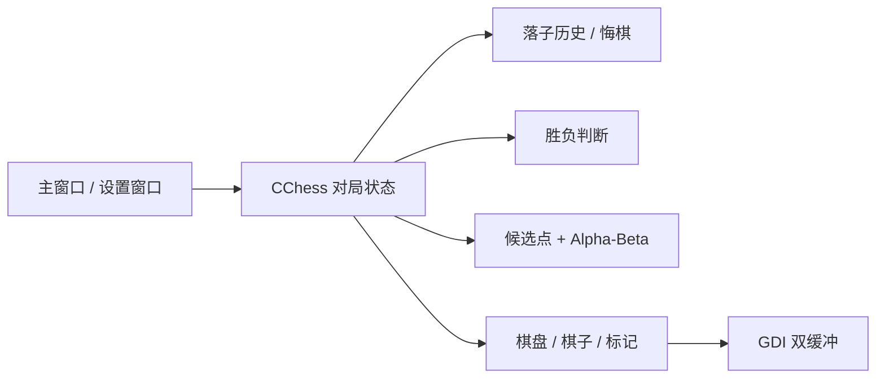

# FiveChess-MFC

一个使用 **原生 C++ / MFC** 实现的 Windows 五子棋桌面应用，由李源晟完成。项目起于东南大学 2024 年暑期学校课程实践，目前已在原有框架上完成界面、渲染、AI、对局状态与工程结构的系统性重构。

> 当前版本：**2.2** · Visual Studio 2022 · Win32 · MFC · Unicode

## 功能

- 15 × 15 五子棋棋盘与五连胜负判断
- **人机对战**：玩家执黑，AI 执白
- **双人对战**：本地黑白双方轮流落子
- 三档 AI：初级 / 标准 / 高级
- Alpha-Beta 剪枝、候选点生成、邻域裁剪与走法排序
- 多步落子历史与稳定悔棋逻辑
- 终局后可悔棋继续本局
- 最近一步红点标记与获胜连线高亮
- 棋盘交叉点悬停预览
- 当前模式、AI 难度、落子数、最近一步、本局用时实时显示
- `Ctrl + Z` 快速悔棋，`F2` / `Ctrl + N` 快速开始新对局
- GitHub Actions 自动完成 `Release | Win32` 构建并提供 Windows 可执行文件

## 2.2 界面与渲染

2.2 重点重做了 Windows 桌面端的显示链路。项目启用 **Unicode + UTF-8 源码编译**，同时对资源编译显式指定 UTF-8 代码页，避免中文标题、状态文字和系统弹窗在不同 Windows 环境下出现乱码。

主窗口启用 Per-Monitor DPI Awareness，并根据当前显示器 DPI 统一缩放边距、侧栏、按钮和最小窗口尺寸。界面使用左侧棋盘 + 右侧状态卡片布局，右侧信息不再依赖空格对齐，而是使用独立标签和值区域绘制。

整个主窗口通过内存 DC 完成双缓冲绘制，棋盘悬停只刷新棋盘区域，计时器只刷新状态侧栏，从而减少鼠标移动和落子时的整窗闪烁。

## AI

AI 实现在 `FiveChess/ChessAI.cpp`。搜索前先从已有棋子周围生成候选点，再根据进攻价值、防守价值和中心位置排序，避免在 15 × 15 棋盘上对所有空点进行无差别搜索。

- **初级**：基于候选点启发式评分直接选点
- **标准**：2 层 Alpha-Beta 搜索
- **高级**：3 层 Alpha-Beta 搜索，并限制高价值候选点数量控制计算量

局面评分会考虑成五、活四、冲四、活三等连续棋型，同时把对手在同一位置的潜在威胁计入候选点优先级。搜索按候选点价值排序展开，以提高 Alpha-Beta 剪枝效率。

## 对局状态

每一步落子都会写入历史记录。双人模式每次撤销一步；人机模式优先撤销完整的“玩家 + AI”回合。如果玩家刚刚形成胜局、AI 尚未落子，则只撤销玩家最后一步。

悔棋会同步恢复当前回合、最近一步、胜负状态和获胜连线。无效点击不会触发额外状态刷新。右侧面板显示最近一步坐标与颜色，并提供本局计时；终局后计时停止，悔棋恢复对局后继续计时。

## 项目结构

```text
FiveChess-MFC/
├─ FiveChess.sln
├─ .github/workflows/build.yml          # Windows Release 构建与 Artifact
├─ .gitignore
├─ README.md
└─ FiveChess/
   ├─ Chess.cpp / Chess.h               # 对局状态、历史记录与主流程
   ├─ ChessAI.cpp / ChessAI.h           # 候选点、评分与 Alpha-Beta AI
   ├─ ChessCommon.cpp / .h              # 棋型与公共逻辑
   ├─ ChessDraw.cpp / .h                # 棋盘、棋子、预览与获胜连线
   ├─ Gobang_FiveChessDlg.cpp / .h      # 主窗口、布局、计时与快捷键
   ├─ DialogMore.cpp / .h               # 对局设置
   ├─ FaceFunc.cpp / .h                 # GDI 绘制辅助
   ├─ MyMemDC.h                         # 双缓冲绘制
   └─ res/                               # 图标与资源
```

## 模块关系



## 直接运行

不安装 Visual Studio 也可以运行。仓库的 GitHub Actions 会自动编译 Windows Release 版本：

1. 打开仓库的 **Actions** 页面。
2. 进入最新一次成功的 **Windows Build**。
3. 在页面底部下载 `FiveChess-v2.2-Windows`。
4. 解压后运行 `FiveChess.exe`。

Artifact 中同时包含 `VERSION.txt` 和简短运行说明。

## 本地构建

环境：Windows 10 / 11、Visual Studio 2022、Desktop development with C++、MFC / ATL support、Platform Toolset `v143`。

使用 Visual Studio 打开 `FiveChess.sln`，选择 `Debug | Win32` 或 `Release | Win32` 后执行 Build Solution。Release 配置使用静态 MFC，Debug 配置使用动态 MFC。

## 操作

| 操作 | 方式 |
| --- | --- |
| 落子 | 点击棋盘交叉点 |
| 新对局 | `F2` 或 `Ctrl + N` |
| 悔棋 | `Ctrl + Z` |
| 对局设置 | 右侧“对局设置”按钮 |

## 作者

**李源晟**

东南大学 · C++ / MFC 五子棋项目
