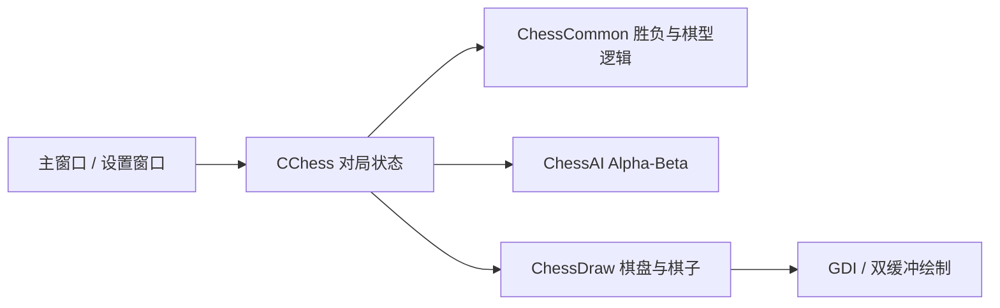

# FiveChess

一个基于 **C++ / MFC** 实现的 Windows 五子棋桌面应用。项目最初来自东南大学 2024 年暑期学校课程实践，现保留原有棋局、AI 与 MFC 框架，在此基础上重新整理界面、交互和仓库结构。

> 当前版本：**2.0** · Visual Studio 2022 · Win32 · MFC

## 功能

- 15 × 15 标准棋盘与五子连珠胜负判断
- **人机对战**：玩家执黑，AI 执白
- **双人对战**：本地黑白双方轮流落子
- 两档 AI：初级 / 高级
- AI 基于局面评分与 **Alpha-Beta 剪枝**
- 单步悔棋与一键开始新对局
- 最近一步红点标记
- 自适应窗口布局与独立对局信息面板
- 对局模式、AI 难度、落子数和当前回合实时显示

## 2.0 界面重构

早期版本采用默认 MFC 控件、粉橙渐变背景和固定按钮布局。2.0 保留原有项目结构，但对显示层重新设计：

- 棋盘改为克制的木色棋盘 + 深色网格
- 黑白棋子重新绘制，增加轮廓、阴影与高光
- 主窗口采用浅灰背景与白色信息卡片
- 主操作区统一为圆角 Owner Draw 按钮
- 设置窗口改为模态对话框，切换模式后自动开始新对局
- 去除未完成的 AI 档位和不完整的“机器对机器”入口
- 修正胜负提示文案、重复弹窗和设置窗口对象泄漏问题

构建完成后建议在 `docs/` 下加入一张最新界面截图，并放在 README 顶部作为项目封面。

## AI 实现

AI 代码位于 `FiveChess/ChessAI.cpp`。项目通过棋型评分函数评估当前局面，并使用 Alpha-Beta 搜索选择下一步位置。

- **初级**：1 层搜索，响应更快
- **高级**：2 层 Alpha-Beta 搜索，考虑更多后续局面

这个实现以课程项目的可读性和完整性为主，并不是竞技级五子棋 AI。后续可以继续加入候选点剪枝、活三/冲四棋型识别、禁手规则和更深层搜索。

## 项目结构

```text
FiveChess/
├─ FiveChess.sln
├─ FiveChess/
│  ├─ Chess.cpp / Chess.h              # 对局状态与主流程
│  ├─ ChessAI.cpp / ChessAI.h          # 局面评分与 Alpha-Beta AI
│  ├─ ChessCommon.cpp / .h             # 棋型与公共逻辑
│  ├─ ChessDraw.cpp / .h               # 棋盘、棋子与最近一步绘制
│  ├─ Gobang_FiveChessDlg.cpp / .h     # 主窗口与现代化布局
│  ├─ DialogMore.cpp / .h              # 对局设置
│  ├─ FaceFunc.cpp / .h                # GDI 绘制辅助
│  ├─ MyMemDC.h                        # 双缓冲绘制
│  └─ res/                              # 图标与资源
└─ .gitignore
```

## 模块关系



## 构建

### 环境

- Windows 10 / 11
- Visual Studio 2022
- Desktop development with C++
- MFC / ATL support
- Platform Toolset `v143`

### 步骤

1. 克隆仓库。
2. 使用 Visual Studio 打开 `FiveChess.sln`。
3. 选择 `Debug | Win32` 或 `Release | Win32`。
4. Build Solution。
5. 运行生成的 `Gobang_FiveChess.exe`。

Release 配置使用静态 MFC，Debug 配置使用动态 MFC。

## 操作说明

启动后默认进入人机对战，玩家执黑。点击棋盘交叉点落子，AI 会自动完成白棋回合。右侧面板可开始新对局、悔棋或进入对局设置。切换对战模式或 AI 难度后，会自动清空棋盘并开始新对局。

## 原项目与维护

该项目最初为 **东南大学 2024 年暑期学校 MFC 课程项目**。

原始项目成员：赵紫涵、李源晟、高艺萌。原代码分别包含图形界面与交互、AI、游戏逻辑等内容。2026 年版本在原项目基础上进行 UI、交互和仓库工程化整理，并保留原项目的课程实践属性与成员署名。

## 后续可以继续做

- AI 候选点生成与搜索剪枝
- 更完整的棋型评分系统
- 禁手 / Renju 规则
- 落子音效与动画
- 对局计时与历史记录
- Release 可执行文件与 GitHub Actions 自动构建

---

**FiveChess** is a small MFC project, but the goal of the refreshed version is to keep it clean, understandable and complete rather than turn it into an oversized framework.
