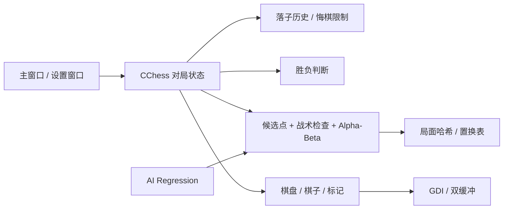

# FiveChess

一个用 **C++ / MFC** 写的 Windows 五子棋程序。项目最初来自东南大学 2024 年暑期学校课程实践，之后继续补了人机对战、搜索 AI、界面、自适应布局、悔棋、自动测试和 Windows 自动构建。

> 当前版本：**2.4** · Visual Studio 2022 · Win32 · MFC

## 功能

- 15 × 15 棋盘与五子连珠胜负判断
- 人机对战：玩家执黑，AI 执白
- 双人对战：本地黑白双方轮流落子
- 三档 AI：初级 / 标准 / 高级
- Alpha-Beta 剪枝、候选点生成、邻域裁剪和走法排序
- AI 落子前优先检查一步获胜与一步必防位置
- 五格窗口威胁识别，可识别 `XX_XX`、`X_XXX` 一类带空位的棋型
- 搜索过程使用局面哈希和置换表缓存重复局面
- 多步落子历史与悔棋，每局最多悔棋 3 次
- 人机模式一次悔棋撤销一整个“玩家 + AI”回合
- 终局后在剩余次数内仍可悔棋继续本局
- 最近一步红点标记、五连获胜线和落子悬停预览
- A–O / 1–15 棋盘坐标
- 自适应窗口布局与独立对局信息面板
- `Ctrl + Z` 悔棋，`F2` / `Ctrl + N` 开始新对局
- GitHub Actions 自动构建、运行 AI 回归测试并打包 Windows 可执行文件

## 界面与绘制

主窗口左侧是棋盘，右侧显示当前状态、对战模式、AI 难度、落子数和剩余悔棋次数。棋盘会标记最近一步，形成五连后画出对应连线；鼠标移动到空交叉点时会显示落子预览。

棋盘和棋子不是通过多张图片切换实现的。网格、棋子、标记、文字和信息栏均由 GDI 按当前对局状态绘制。2.4 将父窗口改为整窗离屏双缓冲，同时把悬停时的刷新范围限制在棋盘区域；落子、悔棋时只刷新棋盘和信息栏，避免每次移动鼠标或落子都重绘整个窗口造成闪烁。

右侧信息栏在 2.4 中加宽，标签和值使用独立区域排版，并提高了窗口最小宽度，避免较长文本被按钮或边界遮挡。

设置窗口可以切换人机 / 双人模式和 AI 难度。难度选择只显示“初级 / 标准 / 高级”，具体搜索实现保留在代码和文档中，不放进操作界面。

## AI

AI 代码在 `FiveChess/ChessAI.cpp`，和 MFC 界面代码分开。它只依赖棋盘数组和 Win32 的基础类型，因此可以单独编译测试。

常规搜索前先做一步战术检查：如果白棋当前有一步可以形成五连，就直接落在获胜点；否则检查黑棋是否存在下一步直接获胜的位置并优先封堵。没有这种直接战术时，再进入候选点和搜索流程。

候选点只从已有棋子附近生成，再根据进攻价值、防守价值和中心位置排序，避免每层遍历 15 × 15 棋盘中的全部空点。评分除连续棋子和开放端外，还检查包含候选点的五格窗口，因此能识别一部分非连续四、三威胁。

标准和高级搜索使用置换表缓存已经搜索过的局面。局面通过确定性的 64 位棋子哈希表示，缓存项记录搜索深度、分数和 Alpha-Beta 上下界类型，减少不同落子顺序到达同一局面时的重复计算。

- **初级**：候选点评分选点，同时保留一步胜 / 一步防判断
- **标准**：2 层 Alpha-Beta 搜索，候选点上限 10
- **高级**：3 层 Alpha-Beta 搜索，候选点上限 8

当前版本仍然把 AI 搜索放在对局线程中，因此没有盲目提高固定搜索深度。后续如果继续增强 AI，优先方向会是有时间预算的迭代加深和异步搜索，而不是直接把深度数字调大。

## 自动测试

`tests/AITacticalTests.cpp` 是一个独立的控制台回归测试，不启动 MFC 窗口。它会对三档 AI 分别检查：

- 空棋盘是否选择中心点
- 有一步可以获胜时是否直接获胜
- 对手下一步可以获胜时是否立即封堵
- 斜线五连是否能正确识别
- 自己可直接获胜和对手有威胁同时存在时，是否优先结束比赛
- 返回位置是否仍是合法空位
- 搜索结束后是否完整恢复传入棋盘，不留下临时搜索棋子

GitHub Actions 在生成 Windows 程序前会先编译并运行这组测试，任一场景失败都会使构建失败。

## 悔棋

每局有 **3 次**悔棋机会，新对局会重置次数。双人模式一次撤销一步；人机模式一般撤销一整个“玩家 + AI”回合。如果玩家刚落子就已经获胜、AI 还没有走，则只撤销玩家最后一步。

右侧信息栏实时显示剩余悔棋次数。次数耗尽后悔棋按钮会禁用，`Ctrl + Z` 也不会继续修改棋盘。

## 直接运行

如果只想运行程序，不需要安装 Visual Studio：

1. 打开仓库的 **Actions** 页面。
2. 进入最新一次成功的 **Windows Build**。
3. 在 **Artifacts** 下载 `FiveChess-v2.4-Windows`。
4. 解压后运行 `FiveChess.exe`。

构建包内还包含 `VERSION.txt` 和简短的 `README.txt`。Actions artifact 保留 30 天，后续成功构建会重新生成。

## 项目结构

```text
FiveChess-MFC/
├─ .github/workflows/build.yml          # Windows 构建、测试与打包
├─ .gitignore
├─ FiveChess.sln
├─ README.md
├─ tests/
│  ├─ AITacticalTests.cpp               # AI 战术回归测试
│  └─ AIRegression.vcxproj              # 独立测试工程
└─ FiveChess/
   ├─ Chess.cpp / Chess.h               # 对局状态、落子、胜负与悔棋
   ├─ ChessAI.cpp / ChessAI.h           # 候选点、评分、缓存与 Alpha-Beta AI
   ├─ ChessCommon.cpp / .h              # 公共棋型逻辑
   ├─ ChessDraw.cpp / .h                # 棋盘、棋子、坐标和标记绘制
   ├─ Gobang_FiveChessDlg.cpp / .h      # 主窗口、双缓冲、布局与快捷键
   ├─ DialogMore.cpp / .h               # 对局设置
   ├─ FaceFunc.cpp / .h                 # GDI 绘制辅助
   ├─ MyMemDC.h                         # 离屏双缓冲绘制
   └─ res/                               # 图标与资源
```

## 模块关系



## 本地构建

环境：

- Windows 10 / 11
- Visual Studio 2022
- Desktop development with C++
- MFC / ATL support
- Platform Toolset `v143`

使用 Visual Studio 打开 `FiveChess.sln`，选择 `Debug | Win32` 或 `Release | Win32` 后直接 Build Solution 即可。Release 配置使用静态 MFC，Debug 配置使用动态 MFC。

AI 回归测试也可以单独构建：

```powershell
msbuild tests\AIRegression.vcxproj /p:Configuration=Release /p:Platform=Win32
.\tests\bin\Release\AIRegression.exe
```

## 快捷键

| 操作 | 快捷键 |
| --- | --- |
| 新对局 | `F2` 或 `Ctrl + N` |
| 悔棋 | `Ctrl + Z` |
| 对局设置 | 右侧“对局设置”按钮 |

## 作者

李源晟  
东南大学
